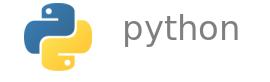
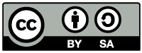

# Curso Básico de Python

Python es un lenguaje de programación de alto nivel, moderno, con una extensa colección de bibliotecas para aplicaciones científicas y técnicas. Su diseño y características lo hacen apto tanto para desarrollo como para enseñanza e investigación.

Este Curso Básico de Python está destinado a lograr una formación sólida en los fundamentos del lenguaje, apta para encarar proyectos de software y acceder a bibliotecas en Python orientadas a temas específicos. El material fue diseñado para poder ser usado en cursos presenciales, semi presenciales o en autoaprendizaje.

## Motivación

Python ha alcanzado una enorme popularidad en enseñanza, investigación y desarrollo. En la enseñanza, se hace muchas veces necesario distraer recursos de temáticas específicas para proveer formación básica en Python. El material reunido en este curso, apto para autoaprendizaje o como base para cursos presenciales o semi presenciales, puede contribuir significativamente al ahorro de tiempo y esfuerzo por parte tanto de docentes como de estudiantes. 
 
Existen mucho material para aprender Python; no tanto en español. En general, estos recursos son muy elementales o muy extensos. Este curso toma como referencia el Tutorial del sitio oficial de Python, pero se presenta como un intermedio entre un tutorial convencional y una "quick reference": apela esencialmente a la experimentación, buscando un rápido dominio del lenguaje con la menor necesidad de apoyo docente. 

Una descripción más detallada de las características del curso se puede ver en la sección [Para instructores](#Para instructores) más adelante.

## Contribuciones

Por errores, sugerencias, o formas de contribuir, por favor ver el documento [Contribuciones](CONTRIBUTING.md). En atención a una pàrticipación respetuosa y productiva, en este proyecto hemos adoptado el siguiente [Código de conducta](CODE_OF_CONDUCT.md)

## Contacto

E-mail: [vagonbar@fing.edu.uy](mailto:vagonbar@fing.edu.uy)

## Tutoriales del curso

1. [Introducción a Python](01-Introduccion/Introduccion.pdf). [Ejemplos](01-Introduccion/ejemplos).

2. [El intérprete de Python](02-Interprete/Interprete.pdf).

3. [Control de flujo](03-ControlFlujo/ControlFlujo.pdf). [Ejemplos](03-ControlFlujo/ejemplos).

4. [Funciones](04-Funciones/Funciones.pdf). [Ejemplos](04-Funciones/ejemplos).  [Documentación de ejemplos](04-Funciones/ejemplos-html/index.html).

5. [Estructuras de datos](05-EstructurasDeDatos/EstructurasDeDatos.pdf). [Ejemplos](05-EstructurasDeDatos/ejemplos).

6. [Módulos](06-Modulos/Modulos.pdf). [Ejemplos](06-Modulos/ejemplos). [Documentación de paquetes ejemplo](06-Modulos/ejemplos/paqs_html/index.html).

7. [Entrada y salida](07-EntradaSalida/EntradaSalida.pdf). [Ejemplos](07-EntradaSalida/ejemplos).

8. [Errores y excepciones](08-Excepciones/Excepciones.pdf). [Ejemplos](08-Excepciones/ejemplos).

9. [Clases](09-Clases/Clases.pdf). [Ejemplos](09-Clases/ejemplos).

10. [Bibliotecas](10-Bibliotecas/Bibliotecas.pdf).

11. Adicionales.

    - [Ejemplo de documentación con pydoctor, TGZ](11-Adicionales/epytext_example.tgz)

## Para instructores

- Características del curso, para instructores (PDF)
- Evaluación Python, características de una aplicación para la evaluación automática, a desarrollar (PDF).

## Licencia

 

Esta obra está licenciada bajo la Licencia Creative Commons Atribución-CompartirIgual 4.0 Internacional. Para ver una copia de esta licencia, visite [http://creativecommons.org/licenses/by-sa/4.0/](http://creativecommons.org/licenses/by-sa/4.0/) o envíe una carta a Creative Commons, PO Box 1866, Mountain View, CA 94042, USA.

Documento de [Licencia](LICENSE.md).
